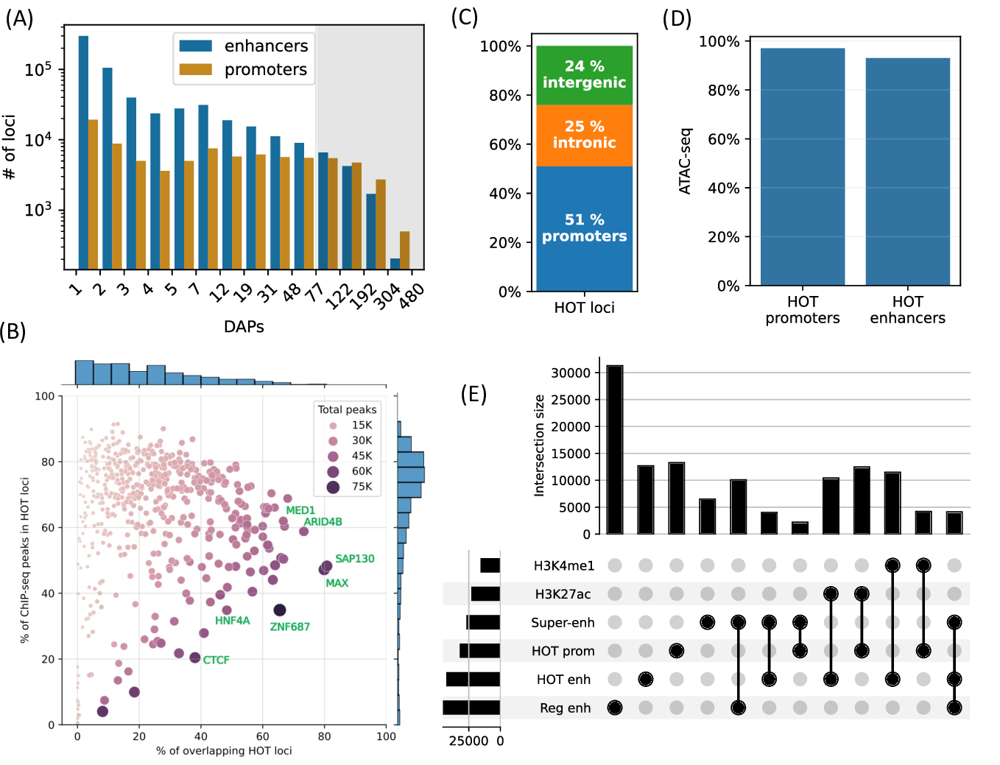
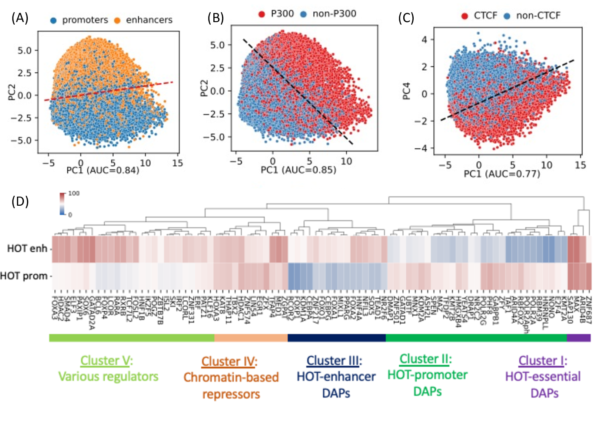
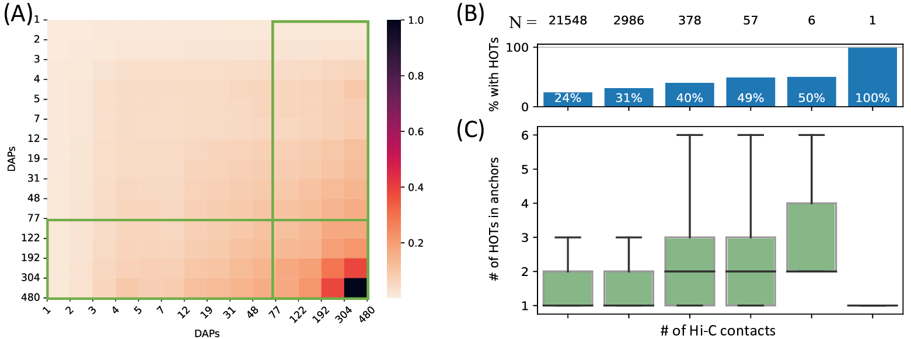
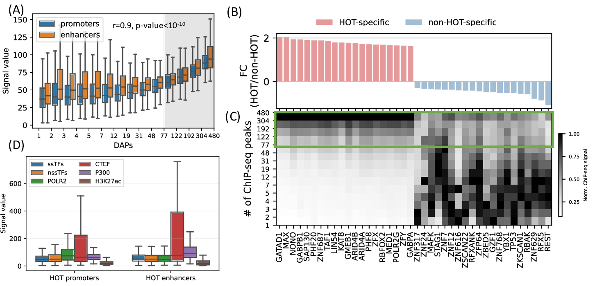
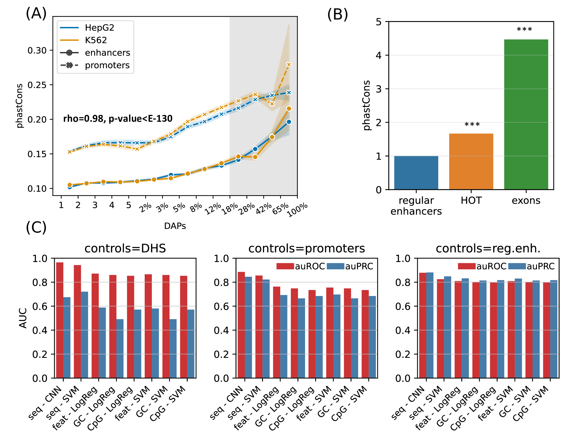
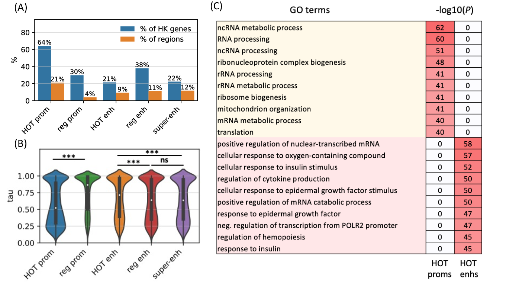
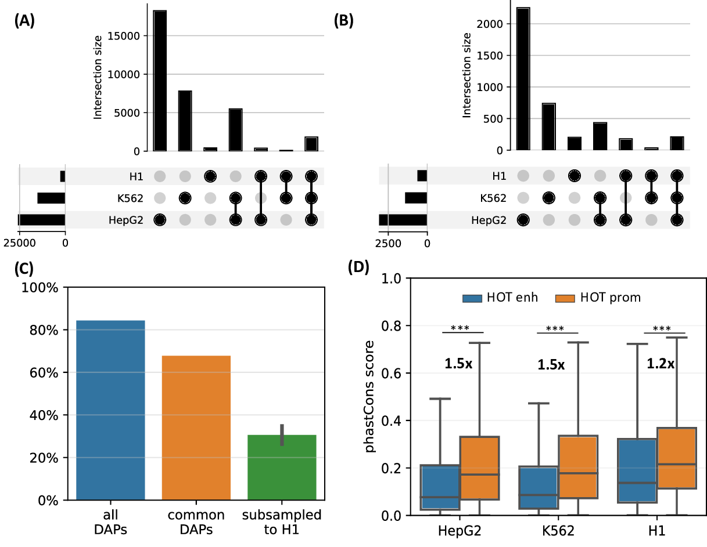
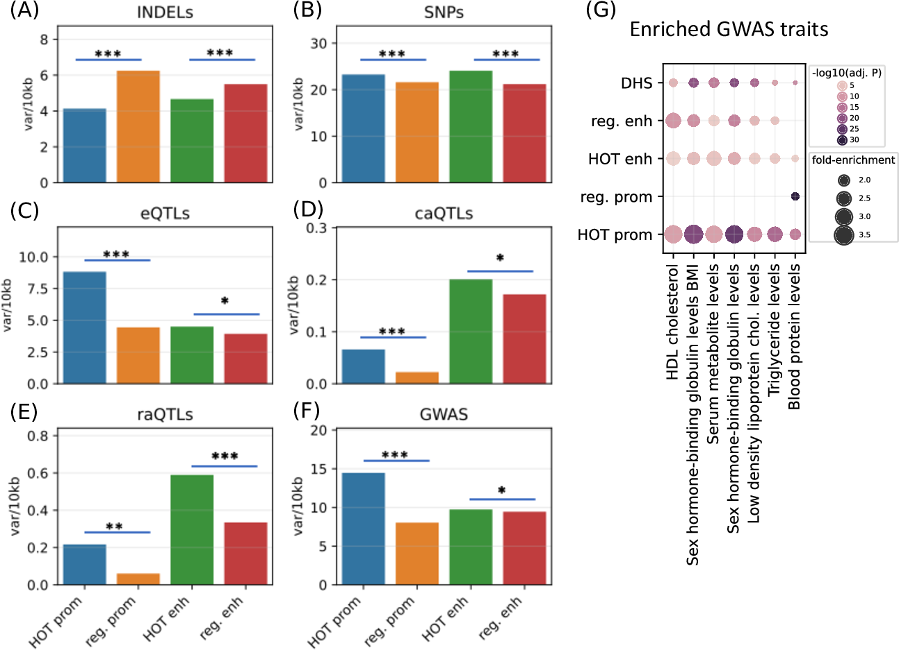

Codebase of the manuscript:

## "Sequence characteristics and an accurate model of high-occupancy target loci in the human genome" 
Sanjarbek Hudaiberdiev, Ivan Ovcharenko 

NCBI, NLM, NIH
Bethesda, MD 20894

https://www.biorxiv.org/content/10.1101/2023.02.05.527203v1
*********

Data Repository
-------

Processed data are available in the Zenodo repository (https://zenodo.org/records/7845121).  
Download and extract to the `data/src_files` directory

For running the code, create a python virtual environment using python>3.6 and install the requirements\
`python3 -m pip install -r requirements.txt`

Transcription factor ChIP-seq files used in the study are listed in the metadata file `metadata_HepG2_K569_H1.txt` (downloaded from ENCODE portal after applying the filters) 

To re-create the study, navigate to the project directory and run: 

```
cd data_prep
python extract_loci.py
```

This will populate with files the following the directories:

- `data/loci/`
- `data/log_bins/`
- `data/HOTs/`

The HOT loci in three cell lines will be extracted to `data/HOTs/` with the names `HepG2_HOTs.bed.gz`, `K562_HOTs.bed.gz` and `H1_HOTs.bed.gz`.


***
#### Figure 1: Definition of HOT loci and compositional analyses



`cd plots`\
`python figure_1.py`


***
#### Figure 2: PCA analysis of HOT loci.



`cd plots`\
`python figure_2.py`


***
#### Figure 3: Hi-C analysis of the HOT loci.



`cd plots`\
`python figure_3.py`


***
#### Figure 4: ChIP-seq signal strength analysis.



`cd plots`\
`python figure_4.py`


***
#### Figure 5: Evolutionary conservation scores (phastCons, phyloP) and classification analysis.



`cd data_pred`\
`python phastCons.py`

Note that this will first create a folder `phastCons` and download the phastCons files from UCSC Genome Browser Database and proceed to extract respective phastCons scores for each bin in `log_bins` directory. This will run approximately for 30 minutes with enough RAM available.

`python figure_5.py`

By default, the data will be downloaded and processed for vertebrates. To re-create the conservation score analyses for placental mammals and primates, re-run the scripts `data_prep/phastCons.py`, `plots/figure_5.py` with parameter values `placentalMammals` and `primates` 

For Figure5-D, please refer to `Classification analysis of HOT loci`


***
#### Figure 6: Functional analysis (GO enrichment, housekeeping, tissue-specificity).



`cd plots`\
`python figure_6.py`

For Figure6-C refer to the main text and supplemental methods.

***
#### Figure 7: 



`cd plots`\
`python figure_7.py`

***
#### Figure 8: 


