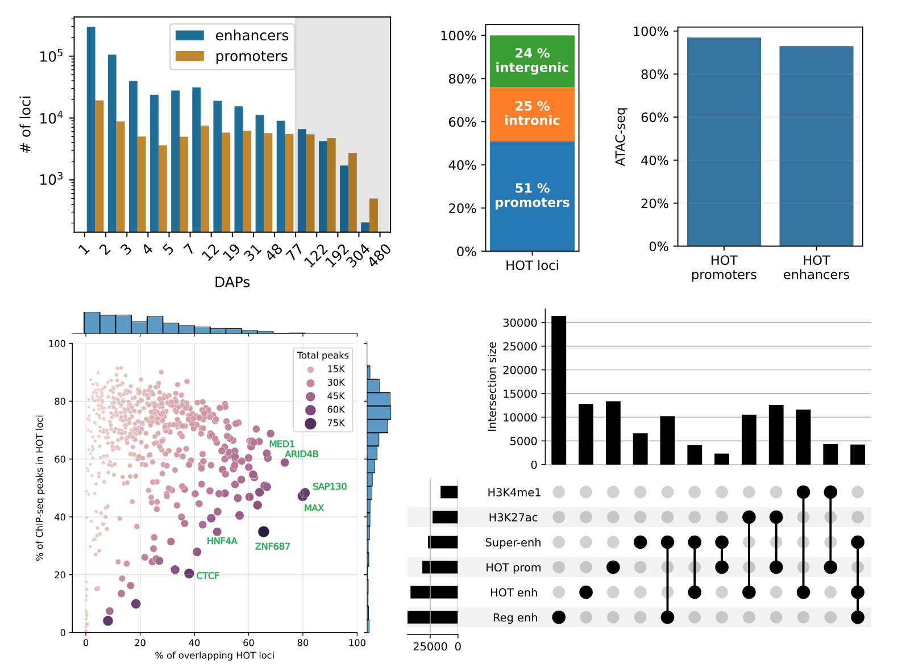
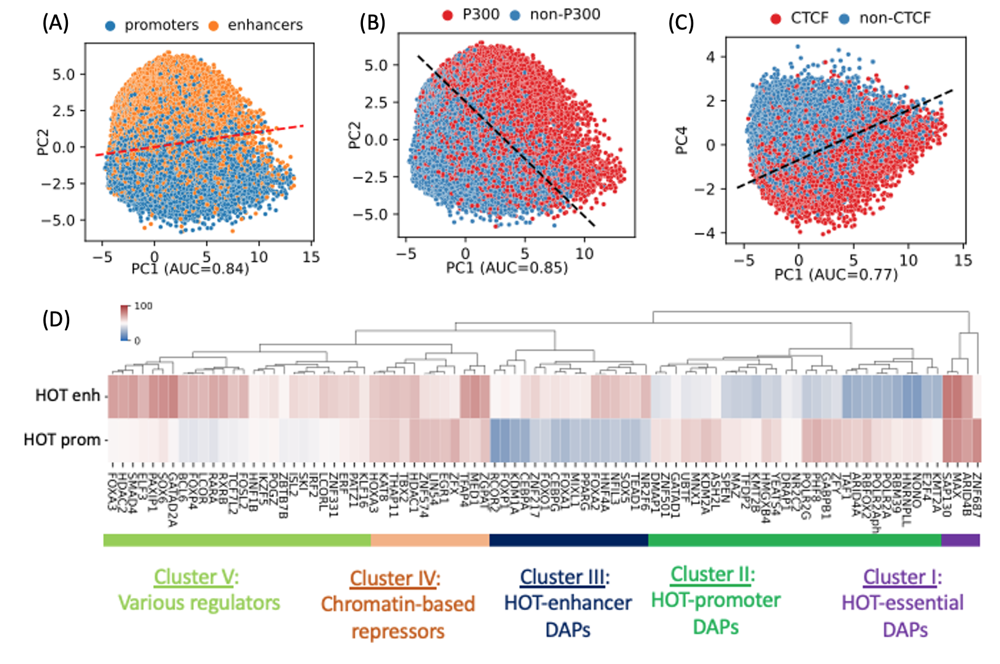
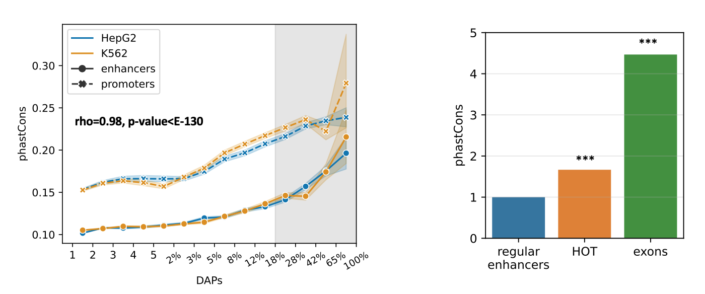
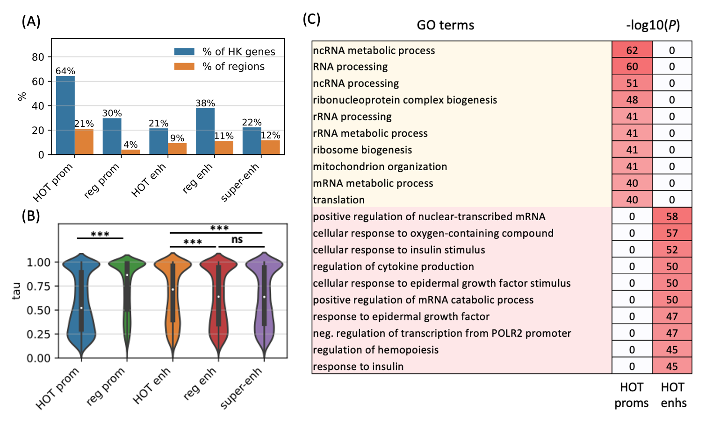

Codebase of the manuscript:

###"Sequence characteristics and an accurate model of high-occupancy target loci in the human genome" 
Sanjarbek Hudaiberdiev, Ivan Ovcharenko 

NCBI, NLM, NIH
Bethesda, MD 20894

https://www.biorxiv.org/content/10.1101/2023.02.05.527203v1
*********

Data Repository
-------

Processed data are available in the Zenodo repository (https://zenodo.org/records/7845121).  
Download and extract to the `data` directory

For running the code, create a python virtual environment using python>3.6 and install the requirements\
`python3 -m pip install -r requirements.txt`

Transcription factor ChIP-seq files used in the study are listed in the metadata file `metadata_HepG2_K569_H1.txt` (downloaded from ENCODE portal after applying the filters) 

To re-create the study, download of the narrow peak files listed in the metadata and run the following 

```
for cl in ["HepG", "K562", "H1"]:
    data_prep.extract_loci.run_locus_extraction(cell_line=cl)
```

### Definition of HOT loci and compositional analyses
***



A) `log_bins.plots.plot_bins_loci_stats_2()`\
B) `HOTs.TF_enrichments.plot_enrichments_jointplot_size()`\
C) `HOTs.plots.hots_prom_enh_barplot()`\
D) `HOTs.plots.plot_ATAC()`\
E) `HOTs.SE_analysis.draw_UpSet_SE_HOT_RE_HM()`

### PCA analysis of HOT loci.
***



### Evolutionary conservation scores (phastCons, phyloP).
***



### Functional analysis (GO enrichment, housekeeping, tissue-specificity).
***



### Variant analyses of the HOT loci.
***


### Classification analyses of the HOT loci.
***


